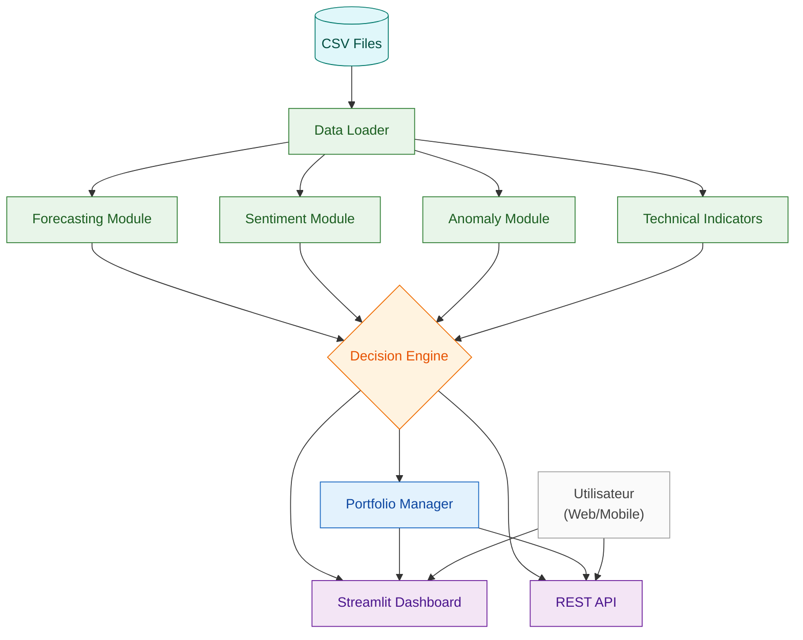
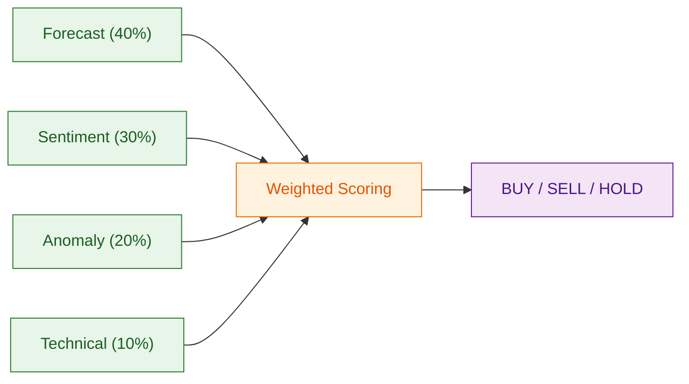

# Architecture Overview

This document provides a high-level architecture view of the BVMT Trading Assistant.

## Legend

- **Cylinders**: Data sources (CSV files)
- **Rectangles**: Processing modules (Forecasting, Sentiment, Anomaly, Technical, Data Loader)
- **Diamonds**: Decision points (Decision Engine, Weighted Scoring)
- **Rounded rectangles**: User interfaces (Streamlit Dashboard, REST API)
- **Solid arrows**: Data and signal flow between layers
